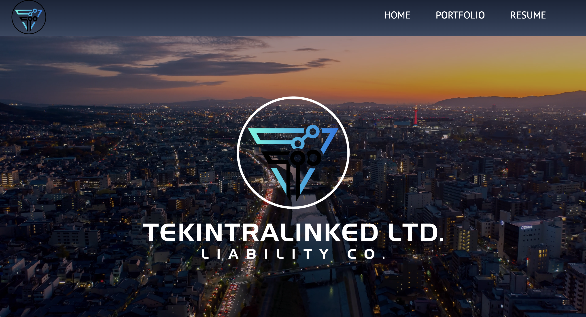
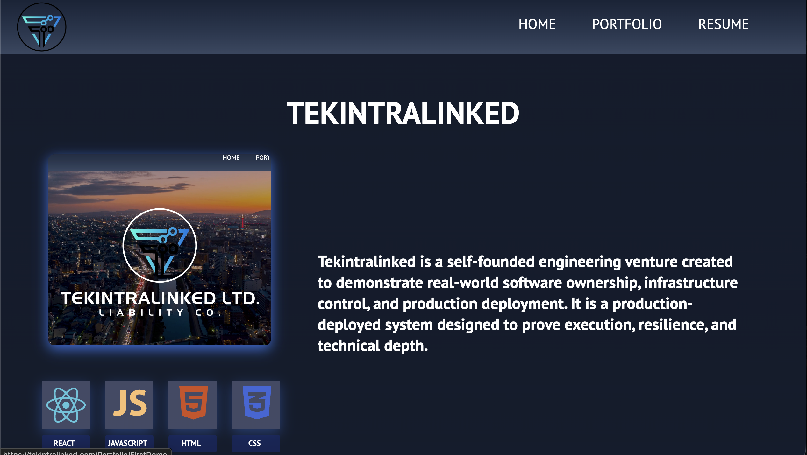
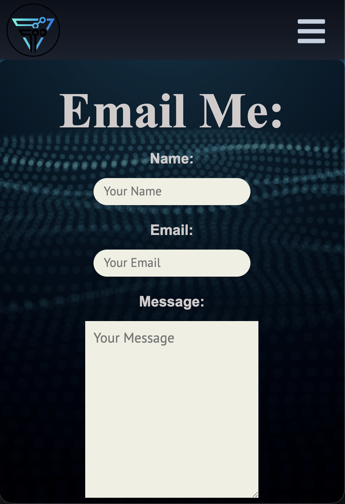

# Tekintralinked LLC v.2.0

A full-stack web application that serves as both a professional portfolio showcasing past projects and the digital presence of Tekintralinked LLC as a holding company. Built with Next.js, React, and Node.js.

---

## 📋 Table of Contents

- [Prerequisites](#prerequisites)
- [Getting Started](#getting-started)
- [Environment Variables](#environment-variables)
- [Running Locally](#running-locally)
- [Screenshots](#screenshots)
- [Tech Stack](#tech-stack)
- [License](#license)

---

## Prerequisites

Before you begin, ensure you have the following installed on your machine:

- [Node.js](https://nodejs.org/) (latest LTS version recommended)
- [npm](https://www.npmjs.com/) (comes bundled with Node.js)
- [React](https://react.dev/) (installed automatically via npm)
- [Next.js](https://nextjs.org/) (installed automatically via npm)

> **Note:** React and Next.js do not need to be installed globally — they will be installed as project dependencies when you run `npm install`.

---

## Getting Started

### 1. Clone the Repository

```bash
git clone https://github.com/your-username/tekintralinked-v2.git
cd tekintralinked-v2
```

### 2. Install Dependencies

```bash
npm install
```

### 3. Set Up Environment Variables

Create a `.env.local` file in the root of the project and add the following variables:

```env
NEXT_PUBLIC_EMAILJS_SERVICE_ID=your_service_id_here
NEXT_PUBLIC_EMAILJS_TEMPLATE_ID=your_template_id_here
NEXT_PUBLIC_EMAILJS_USER_ID=your_user_id_here
```

> **How to get these values:** Log in to your [EmailJS](https://www.emailjs.com/) account and navigate to your dashboard. You will find your Service ID, Template ID, and User (Public) Key there.

> ⚠️ **Never commit your `.env.local` file to version control.** Make sure `.env.local` is listed in your `.gitignore`.

### 4. Run the Development Server

```bash
npm run dev
```

Open your browser and navigate to [http://localhost:3000](http://localhost:3000) to view the application.

---

## Environment Variables

| Variable | Description |
|---|---|
| `NEXT_PUBLIC_EMAILJS_SERVICE_ID` | Your EmailJS Service ID |
| `NEXT_PUBLIC_EMAILJS_TEMPLATE_ID` | Your EmailJS Email Template ID |
| `NEXT_PUBLIC_EMAILJS_USER_ID` | Your EmailJS Public User Key |

---

## Images

### Home Page



### Portfolio / Projects


### Contact



## Tech Stack

| Technology | Purpose |
|---|---|
| [Next.js](https://nextjs.org/) | Full-stack React framework |
| [React](https://react.dev/) | UI component library |
| [Node.js](https://nodejs.org/) | JavaScript runtime |
| [EmailJS](https://www.emailjs.com/) | Client-side email functionality |

---

## License

© 2025 Tekintralinked LLC. All Rights Reserved.

This project and its source code are the exclusive property of Tekintralinked LLC. No part of this codebase may be reproduced, distributed, modified, or used in any form without the express written permission of Tekintralinked LLC.

Unauthorized copying, forking, or reuse of this code, in whole or in part, is strictly prohibited.
